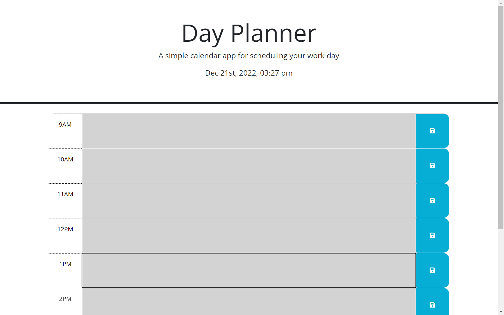

# Day-Planner

## Description

Day Planner is a calender app that allows users to plan out their day by writing and saving notes. It has helpful features like color coding current, past, and current time.

(Link to deployed app)[https://keshon97.github.io/Day-Planner/]

## Screenshot

